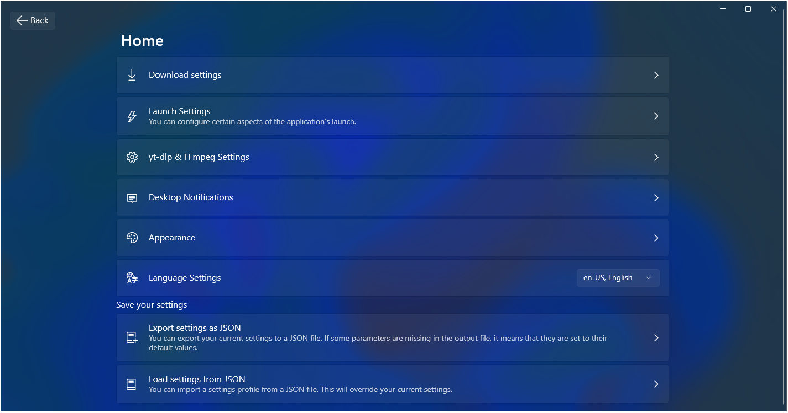

# FluentDownloader

FluentDownloader is a WinUI 3 application that wraps **yt-dlp** and **FFmpeg** to let you download videos from most websites. It provides a Fluent Design interface built with the WinUI 3 toolkit.

## Features

- **Multi-language support**: English and Russian UI (русский и английский)
- **Supports multiple platforms**: Download from YouTube, Vimeo, Twitch, and more.
- **Built-in dependencies**: Bundles `yt-dlp` and `ffmpeg` binaries; can auto-download or update them with user consent.
- **Wide customization**: Adjust numerous `yt-dlp` parameters through the UI.
- **Desktop notifications**: Receive system notifications when downloads start, progress, and complete.
- **Advanced settings**:
  - **Concurrent fragments** (`--concurrent-fragments`)
  - **Download speed limit** (`--limit-rate`)
  - **Proxy support** (`--proxy`)
  - **Output filename template** (`-o`)

### Usage

1. Open the app.
2. Select your language in Settings (English / Русский).
3. Paste the video URL.
4. Configure advanced options and toggle auto-update for dependencies.
5. Click **Download** and watch desktop notifications for status.

## ⚠️ Developer Note

> **Educational Purpose Only**
>
> This project was created as my **first WinUI 3 application**, without external guides. It uses many anti-patterns, is poorly designed, and difficult to navigate.
> It will **not** be supported or maintained. Consider this a **maximum anti-pattern** example—use at your own risk!